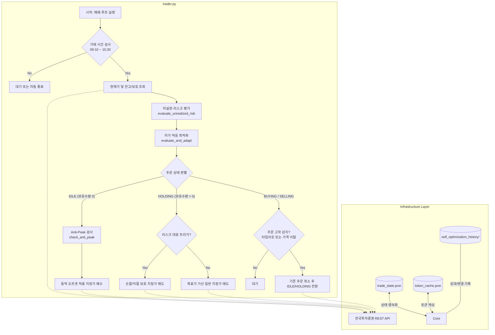

# 📊 KIS Developers 기반 삼성전자(005930) 자가 적응형 자동매매 시스템
> **ECO4126 인공지능과금융공학 프로젝트 결과물**  
> **본 시스템은 한국투자증권 Open API(모의투자 환경)를 기반으로 작동하는 보수적 폴링식 자가 최적화(Self-Adapting) 트레이딩 시스템입니다.**

---

## 1. 프로젝트 개요 및 문제 인식

### 💡 문제 제기 (Motivation)
- **고정형 오프셋 매매의 한계**: 기존의 고정 가격(예: 현재가 - 2,000원 매수, +2,000원 매도) 주문 방식은 횡보장에서는 유효하지만, 급변하는 변동성 장세나 지속적인 하락 추세에서는 매수 주문이 체결된 후 장기 물림 현상이 발생하거나(하락장), 상승 추세에서 조기 매도로 추가 수익 기회를 놓치는(상승장) 구조적 한계가 있습니다.
- **모의투자 환경의 제약성**: 웹소켓 실시간 연결 차단, 매우 낮은 초당 호출 제한(TPS), 빈번한 타임아웃 및 불안정한 모의 체결 서버 환경에서 어떻게 시스템 안정성을 담보할 것인가에 대한 실무적 과제가 존재합니다.

### 🎯 프로젝트 목표 (Objective)
본 프로젝트는 **"시장 환경에 맞추어 파라미터를 스스로 수정하는 자가 적응형(Self-Improving) 엔진"**과 **"다중 장치 리스크 제어 필터(Anti-Peak, Trailing Stop, Hard Stop-Loss)"**를 설계하여, 모의투자 환경에서 안정적인 자산 방어 및 알파 수익 창출을 동시에 실현하는 것을 목표로 합니다.

---

## 2. 금융공학적 매매 전략 및 제어 로직

본 시스템은 단순 가격 지정 주문을 넘어, 실시간 시장 지표와 자산 상태를 기반으로 주문 가격과 리스크 제어 방안을 매 루프마다 실시간으로 재산정합니다.

### 2.1. 자가 적응형 최적화 메커니즘 (Self-Improving Engine)
`evaluator.py`에 구현된 자가 적응형 로직은 **종합 점수제(Scoring System)**에 기반하여 작동합니다. 20분의 변경 쿨다운(Cool-down) 장치를 두어 과적합(Overfitting)을 방지하며, 다음의 3가지 핵심 요인을 결합해 `BUY_OFFSET`과 `SELL_OFFSET`을 동적으로 재조정합니다.

$$\text{Total Score} = \text{Unrealized PnL Score} + \text{Market Volatility Score} + \text{Historical Performance Score}$$

| 평가 요인 | 세부 조건 | 점수 영향 | 파라미터 보정 방향 |
| :--- | :--- | :--- | :--- |
| **미실현 손익** | 미실현 손실 $\le -2.0\%$ | $+20$ 점 | 오프셋 확대 (매수 목표가를 더 낮춰 보수적 진입) |
| | 미실현 수익 $\ge +1.5\%$ | $-10$ 점 | 오프셋 축소 (공격적 포지션 정리 유도) |
| **시장 변동성** | 최근 고저차 변동성 $> 2.0\%$ | $+15$ 점 | 오프셋 확대 (변동성 장세 대비 안정거리 확보) |
| (15분 OHLC) | 최근 고저차 변동성 $< 0.5\%$ | $-15$ 점 | 오프셋 축소 (정체 시장에서 빠른 체결 유도) |
| **과거 성과** | 누적 손익(PnL) 음수 | $+15$ 점 | 오프셋 확대 (보수적 매매로 전환) |
| (최근 5회) | 최근 5회 승률 $> 70\%$ | $-10$ 점 | 오프셋 축소 (공격적 알파 수익 추구) |

> **동적 파라미터 조정 공식**: 
> 최종 결정된 누적 점수($\text{Total Score}$) 1점당 50원 단위로 기본 오프셋을 가감하여 최저 1,000원 ~ 최고 10,000원 한도 내에서 유동적으로 조절합니다.
> - $\text{New BUY\_OFFSET} = \text{Clip}(\text{BUY\_OFFSET}_{base} + \text{Total Score} \times 50, 1000, 10000)$
> - $\text{New SELL\_OFFSET} = \text{Clip}(\text{SELL\_OFFSET}_{base} + \frac{\text{Total Score}}{2} \times 50, 1000, 10000)$

---

### 2.2. 고점 매수 방지 필터 (Anti-Peak / Anti-FOMO Filter)
급격한 시세 상승 구간(FOMO 영역)에서 상단에 물리는 현상을 원천 방지하기 위해 분봉 및 일봉을 교차 분석하는 **Anti-Peak 알고리즘**을 적용합니다.

1. **단기 과열 검증 (분봉 기준)**
   - 30분 내 분봉 RSI $\ge 70$ 또는 20MA 대비 이격도 $> 101.5\%$ 일 경우: 매수 오프셋 $+1,000\text{원} \sim +1,500\text{원}$ 가산.
2. **거시 과열 검증 (일봉 기준)**
   - 일봉 RSI $\ge 70$ 또는 20일 이동평균선 이격도 $> 105.0\%$ 일 경우: 매수 오프셋 $+3,000\text{원} \sim +5,000\text{원}$ 가산 (진입 보류 및 강력한 관망 유도).

---

### 2.3. 다중 리스크 제어 시스템 (Multi-Layer Risk Management)
주문이 체결된 후, 포지션을 보유한 상태에서는 실시간 미실현 손익률을 바탕으로 익절/손절 관리를 수행합니다.

- **하드 손절 (Stop-Loss)**: 보유 종목의 미실현 손실률이 **$-3.0\%$ 이하**에 도달할 경우, 즉각 기존 일반 매도 주문을 취소하고 현재가 수준(체결을 보장하기 위해 호가 내림 보정)으로 즉시 시장가 성격의 지정가 매도 주문을 전송합니다.
- **수익 보존 (Trailing Profit Protection)**: 보유 종목의 수익률이 **$+1.0\%$ 고점**을 갱신한 후, 고점 대비 **$0.5\%$ 이상 하락**하여 반락할 때 이익 확정(Trailing Stop)을 실행하여 확보된 누적 수익을 보존합니다.

---

## 3. 시스템 아키텍처 및 모듈 구성

### 3.1. 아키텍처 흐름도 (Mermaid)



### 3.2. 모듈별 책임 명세

| 파일명 | 역할 및 기능 설명 |
| :--- | :--- |
| **[main.py](file:///C:/Users/witpo/OneDrive/바탕 화면/YONSEI/26-1/ECO4126 인공지능과금융공학/open-trading-api/samsung_auto_trader/main.py)** | 프로그램 진입점. 당일 토큰을 발급/로드하고, KISClient를 구성하여 매매 루프를 구동함. |
| **[config.py](file:///C:/Users/witpo/OneDrive/바탕 화면/YONSEI/26-1/ECO4126 인공지능과금융공학/open-trading-api/samsung_auto_trader/config.py)** | 종목 정보(005930), 기본 오프셋, 타임아웃, 거래 시간(09:10 ~ 15:30) 등 글로벌 환경 설정 관리. |
| **[auth.py](file:///C:/Users/witpo/OneDrive/바탕 화면/YONSEI/26-1/ECO4126 인공지능과금융공학/open-trading-api/samsung_auto_trader/auth.py)** | KIS API 인증 모듈. 당일 발급받은 토큰을 `token_cache.json`에 저장하고 재사용해 불필요한 API 호출을 배제. |
| **[api_client.py](file:///C:/Users/witpo/OneDrive/바탕 화면/YONSEI/26-1/ECO4126 인공지능과금융공학/open-trading-api/samsung_auto_trader/api_client.py)** | KIS Developers REST API 연동을 위한 베이스 HTTP 클라이언트. 헤더 구성 및 공통 예외 처리. |
| **[market_data.py](file:///C:/Users/witpo/OneDrive/바탕 화면/YONSEI/26-1/ECO4126 인공지능과금융공학/open-trading-api/samsung_auto_trader/market_data.py)** | 삼성전자 현재가 및 이평선/RSI 연산을 위한 분봉·일봉 OHLCV 시세 데이터 수집 모듈. |
| **[account.py](file:///C:/Users/witpo/OneDrive/바탕 화면/YONSEI/26-1/ECO4126 인공지능과금융공학/open-trading-api/samsung_auto_trader/account.py)** | 예수금 잔고 조회 및 특정 종목 보유 수량, 주문 가능 수량, 평균 매입단가 실시간 트래킹. |
| **[orders.py](file:///C:/Users/witpo/OneDrive/바탕 화면/YONSEI/26-1/ECO4126 인공지능과금융공학/open-trading-api/samsung_auto_trader/orders.py)** | 신규 지정가 매수/매도 주문 전송 및 미체결 주문 취소 실행. 호가단위(Tick size) 정밀 매핑. |
| **[trader.py](file:///C:/Users/witpo/OneDrive/바탕 화면/YONSEI/26-1/ECO4126 인공지능과금융공학/open-trading-api/samsung_auto_trader/trader.py)** | 본 트레이딩 시스템의 코어 엔진. 상태 머신 기반 주문/체결 검증 및 타임아웃, 리스크 제어 연계. |
| **[evaluator.py](file:///C:/Users/witpo/OneDrive/바탕 화면/YONSEI/26-1/ECO4126 인공지능과금융공학/open-trading-api/samsung_auto_trader/evaluator.py)** | 성과 모니터링, scoring 시스템 기반 파라미터 최적화, Stop-loss 및 Trailing stop 리스크 계산. |
| **[state.py](file:///C:/Users/witpo/OneDrive/바탕 화면/YONSEI/26-1/ECO4126 인공지능과금융공학/open-trading-api/samsung_auto_trader/state.py)** | 프로그램 비정상 종료 시 복구를 위한 상태 관리 모듈 (`trade_state.json` 영속화 및 백업). |
| **[logger.py](file:///C:/Users/witpo/OneDrive/바탕 화면/YONSEI/26-1/ECO4126 인공지능과금융공학/open-trading-api/samsung_auto_trader/logger.py)** | 콘솔 출력과 `logs/` 파일 저장을 병행하여 디버깅 및 사후 검증을 위한 구조화된 로깅 수행. |
| **[utils.py](file:///C:/Users/witpo/OneDrive/바탕 화면/YONSEI/26-1/ECO4126 인공지능과금융공학/open-trading-api/samsung_auto_trader/utils.py)** | 국내 주식 가격 규격에 맞게 가격을 호가 단위(Tick)에 맞추는 수학적 라운딩 헬퍼 함수 제공. |

---

## 4. 시스템 안정성 및 모의투자 환경 극복 설계

본 시스템은 모의투자 계좌의 혹독한 호출 제약 조건을 견딜 수 있도록 최적화되어 설계되었습니다.

1. **토큰 재사용 정책 (Token Re-use)**: 당일 오전 발급받은 토큰은 `token_cache.json`에 기록해 두고 24시간 동안 재사용하므로, 중복 재발급으로 인한 계정 일시 잠김이나 불필요한 네트워크 지연을 완전 배제합니다.
2. **보수적 폴링 및 호출 대기 (TPS 보호)**: 한투 모의투자 서버의 낮은 초당 거래건수 제한(보통 1초에 2~3회 호출 시 차단)을 극복하기 위해, 매 트레이딩 루프 사이의 기본 대기 시간(POLLING_INTERVAL = 60초)을 유지하며 주문 취소/에러 상황 시 2~3초의 쿨링 대기를 명시적으로 삽입했습니다.
3. **유령 주문 감지 및 자동 복구 (Ghost Order Handling)**: 모의투자 서버는 간혹 체결이 지연되거나 원주문이 데이터베이스상에서 일시적으로 누락되는 현상이 발생합니다. 이때 주문 취소 시 `40220000`(존재하지 않는 원주문) 에러가 반환되는 경우, 시스템이 정지하지 않고 로컬 상태(`trade_state.json`)를 강제 리셋하여 정상 궤도로 자동 복구합니다.
4. **상태 영속화 (Crash Resilience)**: 네트워크 단절이나 에러로 인해 프로그램이 비정상적으로 크래시 나더라도, `trade_state.json`에 저장된 상태(보유 상태, 진입가, 누적 손익, 파라미터 등)를 재부팅 시 그대로 로드하므로 포지션 오판이나 이중 주문 등의 인적 재난을 예방합니다.

---

## 5. 실행 및 검증 가이드

### 5.1. 환경 변수 설정
프로젝트 루트 폴더에 `.env` 파일을 생성하고 아래와 같이 한국투자증권 모의투자 정보를 입력합니다.
```env
GH_APPKEY="발급받은_모의투자_AppKey"
GH_APPSECRET="발급받은_모의투자_AppSecret"
GH_ACCOUNT="모의투자_계좌번호_8자리"
GH_ACCOUNT_PRDT_CD="01"
```

### 5.2. 의존성 설치 및 실행
```bash
# 의존성 설치
pip install -r samsung_auto_trader/requirements.txt

# 프로그램 백그라운드/포그라운드 실행 (프로젝트 루트 디렉토리 기준)
python -m samsung_auto_trader.main
```

### 5.3. 사후 검증 및 교차 대조 도구 (Cross-Validation)
프로그램이 기록한 로컬 상태 기록(`trade_state.json`)이 실제 한국투자증권 모의 서버의 계좌 데이터와 정확히 일치하는지 교차 대조할 수 있도록 세 가지 전용 분석 툴을 제공합니다.

- **로컬 누적 손익 통계 산출**:
  ```bash
  python -m samsung_auto_trader.sum_state_pnl
  ```
- **당일 KIS 서버 체결 내역 대조 검증**:
  ```bash
  python -m samsung_auto_trader.verify_kis_daily_ccld
  ```
  *로컬 데이터와 실제 거래 내역의 체결 시간/체결 수량을 1:1로 비교하여 오차 유무를 진단합니다.*
- **기간별 손익 대조 검증**:
  ```bash
  python -m samsung_auto_trader.verify_kis_period_profit
  ```

---

## 6. 계좌 변경 대응 가이드 (운영 편의성)
과제 진행 중 모의투자 계좌를 변경(예: 새로운 모의투자 대회 계좌 연결)하게 될 경우, 로컬 데이터(`trade_state.json`)와의 정합성이 깨지는 문제가 발생할 수 있습니다. 

- **조치 사항**:
  1. `.env` 파일의 `GH_ACCOUNT` 정보를 신규 계좌로 업데이트합니다.
  2. 프로그램 재실행 전 `trade_state.json`에 기록된 `"CAN_ACCOUNT"` 값이 새로운 계좌번호와 일치하는지 확인합니다.
  3. 만약 잔고 및 보유 종목의 괴리가 심할 경우, 기존 `trade_state.json` 파일을 백업하고 삭제한 뒤 프로그램을 재실행하면 시스템이 신규 계좌의 실제 상태(보유량 0 등)에 자동으로 초기 동기화됩니다.


